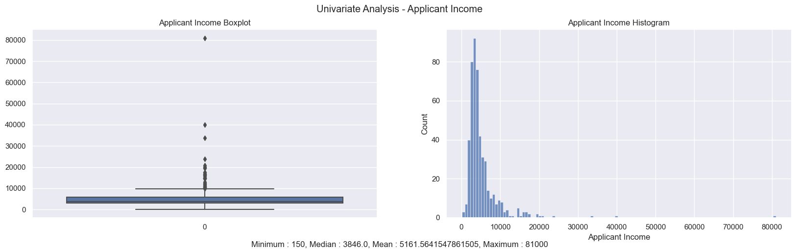
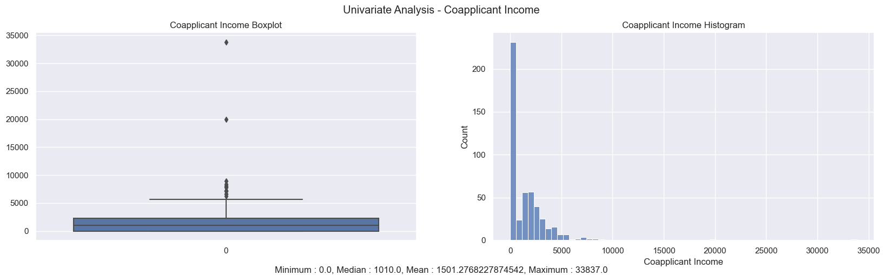
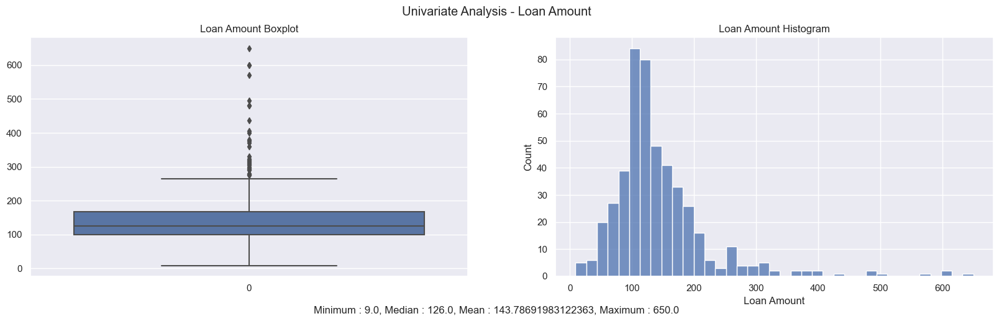
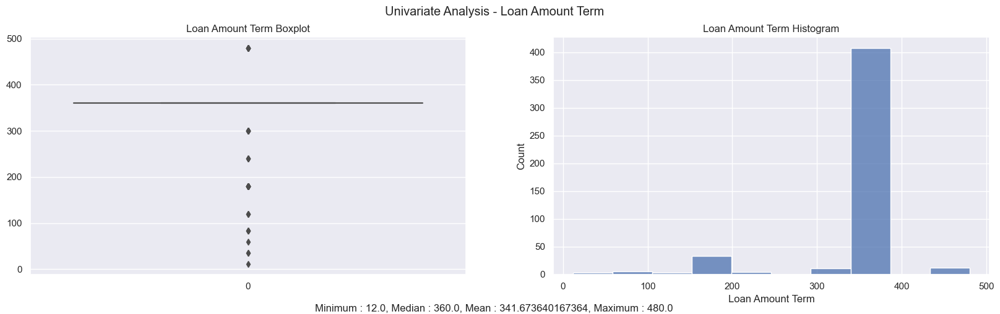
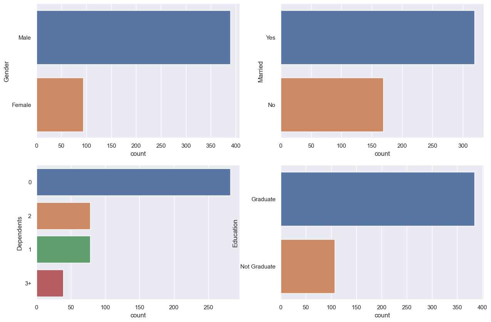
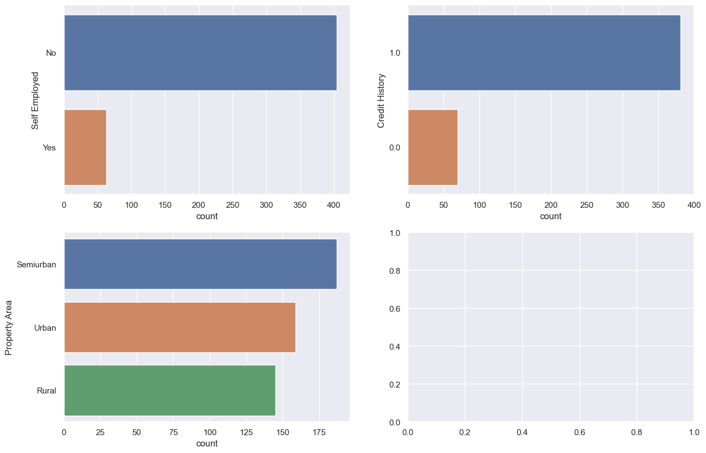
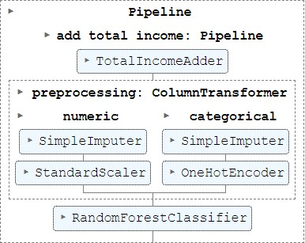
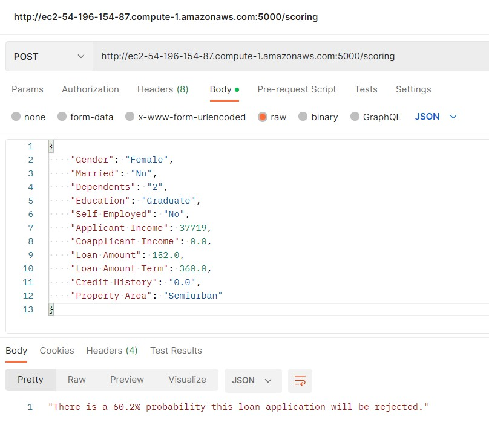
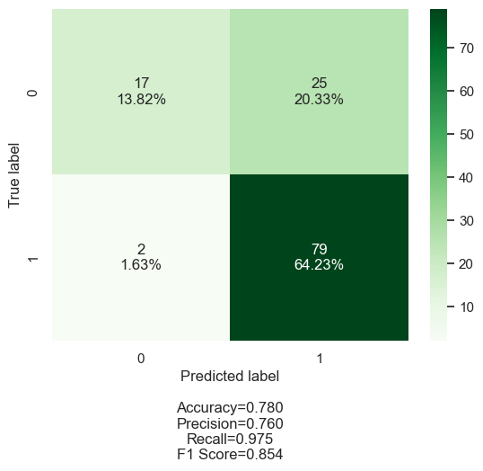
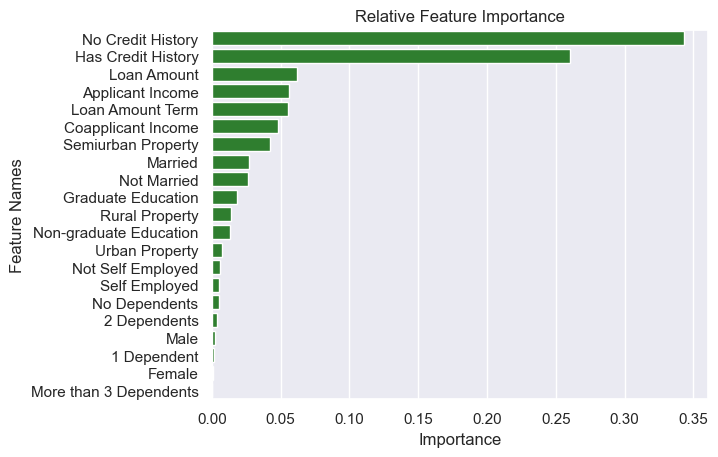

# Mini-project IV

### [Assignment](assignment.md)

## Project/Goals
The aim of this project is to use historical loan application data to predict if new applicants will be approved for a loan.

To make these predictions, the goal is to create a supervised machine learning classification model using sklearn Pipelines and then to deploy the model in the cloud by creating an API that will respond to POST requests with a prediction of whether or not a loan application will be approved. 

## Hypothesis

Before looking at the data, I hypothesized that the following types of applicants would be more likely to get a loan:

1. Applicants having a credit history 
2. Applicants with higher applicant and co-applicant incomes
3. Applicants with higher education level
4. Applicants with properties in urban areas with high growth perspectives
5. Applicants who are married
6. Applicants with fewer dependents
7. Applicants who are not self-employed
8. Applicants applying for a lower loan amount
9. Applicants applying for a shorter-term loan

I will examine these hypotheses by comparing the percentage of applicants in each of these categories who get their loans approved (for categorical features), or by comparing the mean values of numeric features for those who get their loans approved vs. those who don't.

## EDA 
- Univariate Analysis (Numerical): Examined distribution of income, loan amount, and loan amount term - all are positively skewed with some extreme outliers. It seems possible, based on the other datapoints, that some of the outliers are errors (perhaps an extra zero was added to an income of 8000 to give 80000), although it's difficult to tell without more information.

- Univariate Analysis (Categorical): Examined frequency of all categorical variables and noted that there are significant class imbalances (e.g., many more male applicants than female, many more applicants with credit history than without)

- Bivariate Analysis: Examined loan approval rate by category for categorical features, and compared mean of numeric features to loan status.
.png)
.png)
- Evaluation of original hypotheses that the following applicants would be more likely to have their loan approved:
    1. Applicants having a credit history
        - Data supports this
    2. Applicants with higher applicant and co-applicant incomes 
        - Data shows no difference / small difference in the opposite direction
    3. Applicants with higher education level
        - Data supports this
    4. Applicants with properties in urban areas with high growth perspectives
        - Data shows semiurban property area is associated with the highest loan approval rate
    5. Applicants who are married
        - Data supports this
    6. Applicants with fewer dependents
        - Data shows applicants with 2 dependents are sightly more likely to have their loan approved than those with 0,1, or 3+ dependents
    7. Applicants who are not self-employed
        - Data supports this
    8. Applicants applying for a lower loan amount
        - Data shows no difference
    9. Applicants applying for a shorter-term loan
        - Data shows no difference
- Key EDA takeaways:
    - 69 % of all loan applications are approved
    - The largest difference in approval rates is between applicants with a credit history (79% approval rate) and those without a credit history (7% approval rate)
    - There are large imbalances in the number of applicants belonging to different categories
    - Applicant / Coapplicant Income & Loan Amount features are positively skewed due to a small number of extremely high values

## Process
### Step 1 - Initial Cleaning:
- Renamed columns for better readability (removed underscores etc.)
- Made sure there were no duplicate Loan IDs and then dropped the Loan ID column as it wouldn't provide any useful information during analysis
- Replaced Loan Status categories so that 1 = loan approved, and 0 = loan not approved
- Fixed data types - Credit History is a categorical feature, so converted data type from int to string
- Divided data into features and target (loan status)
### Step 2 - Train/Test Split:
- Made an 80/20 train/test split. Since it's a small dataset (only 614 values), used a relatively smaller portion for test data in order to keep as much data as possible to train the model.
### Step 3 - Exploratory Data Analysis & Further Cleaning:
- Univariate Analysis (Numerical/Categorical) & Bivariate Analysis: See EDA section above for details.
- Identified null values and added a preprocessing step to the machine learning pipeline to impute the mean for missing numerical features, and impute the mode for the missing categorical features.
- Used standard scalar to scale skewed numeric features in order to keep the relationships among data points and reduce the impact of the large numbers on the model
### Step 4 - Creating a Pipeline / Building a Predictive Model
- Created individual categorical and numeric preprocessing pipelines to carry out the following preprocessing steps:
    - Categorical: 
        - Imputing most common category for missing values using SimpleImputer
        - One Hot Encoding features using oneHotEncoder
    - Numeric:
        - Imputing mean for missing values using SimpleImputer
- Applied categorical and numeric preprocessing pipelines to the appropriate columns using Column Transformer
- Created main pipeline including the preprocessing and modelling steps
- Trained several classification models to determine which type of model performed the best:
    - Logistic Regression
    - Naive Bayes
    - Decision Tree
    - Support Vector Machine
    - Stochastic Gradient Descent
    - Random Forest
- Chose the Random Forest for further development because it had one of the best F1 Scores (0.854).
- Added a feature engineering step to the pipeline to combine Applicant and Coapplicant Income into a new feature called 'Total Income' (see Random Forest - Iteration 2 in [instructions.ipynb](notebooks/instructions.ipynb))

- Used GridSearch to tune the model's hyperparameters (see Random Forest - Iteration 3 in [instructions.ipynb](notebooks/instructions.ipynb))
- Tried replacing Standard Scalar with a Function Transformer (see Random Forest - Iteration 4 in [instructions.ipynb](notebooks/instructions.ipynb)) 

### Step 5 - Model Deployment & Testing
- Pickled the [final model](data/rf_model1.pkl)
- Created a flask app in [app.py](src/app.py)
- SSH'd into AWS virtual machine instance
- From within a tmux session, opened jupyter lab and copied in the pickle of the final model and the flask app
- From within the tmux session, ran app.py
- Made POST requests via python and Postman to test that the model successfully predicts probabilities of each class (loan not approved or loan approved), and then returns an appropriate response (i.e., 'There's an X% probability this loan will be approved / regjected')

## Results/Demo
- The model is 78% accurate, with a precision of 76% and a recall of 98%.
- The feature engineering and hyperparameter tuning steps I took did not change the model performance.

- An examination of feature importance shows that credit history is the most important factor in determining whether someone is approved for a loan:

## Challenges
- I initially had difficulty understanding how to integrate custom transformers into the pipeline; the main obstacle was that my preprocessing steps were converting the df_train dataframe into a numpy array, so I had to apply my feature engineering step (combining Applicant and Coapplicant Income into one feature) before doing this preprocessing so I could refer to column names from the dataframe.
- I had initial issues making POST requests to the API because the scikit learn version in the app.py file was different from the version in the AWS instance.  I solved the issue by updating the sklearn version in the AWS instance.

## Future Goals
- I would like to:
    - look more closely at applicants that did not meet the credit history requirements and see what they have in common, and use that information to experiment with more feature engineering
    - try integrating more steps into the pipeline
    - try RandomSearch instead of GridSearch to conduct hyperparameter tuning within the pipeline
    - try including different imputer types (e.g., KNN imputer), scalers (e.g., MinMax scaler) in the RandomSearch/GridSearch to pick the ones that give the best model performance
    - add the custom functions I created for plotting to .py files and then import them as needed
    - investigate if using a different classification threshold would improve the model performance
